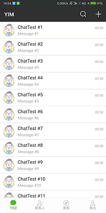
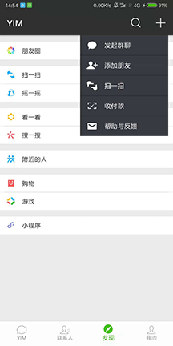
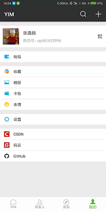
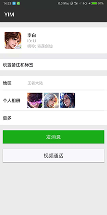
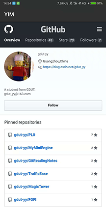
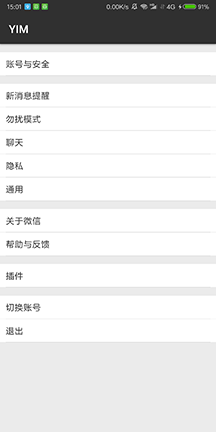

# Yi (YIM) 客户端

## YIM v1.0.1
YIM 是本人基于即时通讯（IM）技术开发的移动端应用。项目设计目标为参考WeChat客户端的架构，实现简单登录、注册、登出功能；实现基本文本传输、语音传输、图片传输、文件传输等功能；实现好友系统、单聊（C2C）、群聊（C2G）等功能。，仅供个人学习所用。

## 应用截图

### 部分一级跳转页面
   

### 部分二级跳转页面 
   
## 历史版本

| 序号 | 版本号 | 说明 |
| :-: | :-: | - |
| 1 | v1.0.0 | 专业设计提交版本 |
| 2 | v1.0.1 | 新增聊天界面 Emoticon 模块、Toolbar 模块 |

## 最新版开发环境

1. Android Studio >= 3.1.4
2. Gradel Version: 4.4
3. Android Plugin Version: 3.1.4
4. minSdkVersion：21
5. targetSdkVersion 27

## 相关依赖

	// BottomNavigation：https://github.com/Ashok-Varma/BottomNavigation
    implementation 'com.ashokvarma.android:bottom-navigation-bar:2.0.5'
    implementation 'com.android.support:recyclerview-v7:27.1.1'
    // TinyPinyin核心包：https://github.com/promeG/TinyPinyin
    implementation 'com.github.promeg:tinypinyin:2.0.3'
    // Optional compile for GCM (Google Cloud Messaging).
    implementation 'com.google.android.gms:play-services-gcm:10.2.1'
    implementation 'com.hyphenate:hyphenate-sdk:3.3.0'
	// glide
    implementation 'com.github.bumptech.glide:glide:3.7.0'

## UI 素材

UI素材自个人另一个开源项目：[https://github.com/gdut-yy/OpenUI](https://github.com/gdut-yy/OpenUI)
