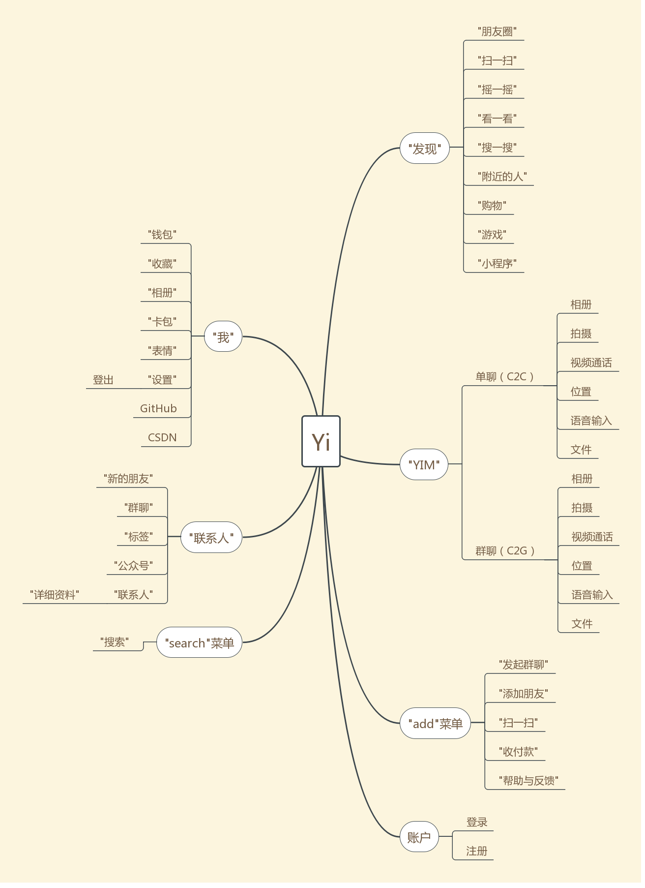
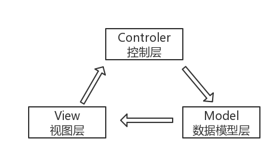
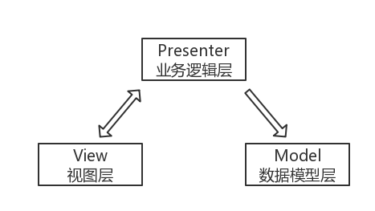
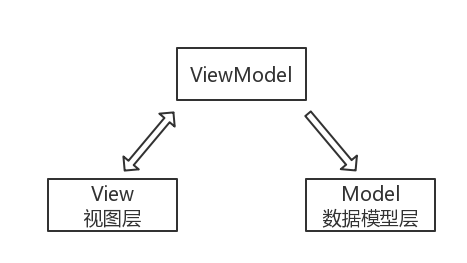
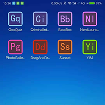

# 专业设计报告

## 1. 项目设计目标

Yi 是本人独立开发的一款仿微信的即时通讯应用，只为提升个人安卓开发能力，仅为个人学习所用。

即时通讯（Instant messaging，简称IM）是一个终端服务，允许两人或多人使用网路即时的传递文字讯息、档案、语音与视频交流。即时通讯按使用用途分为企业即时通讯和网站即时通讯，根据装载的对象又可分为手机即时通讯和PC即时通讯，手机即时通讯代表是短信，网站、视频即时通讯。

（备注：微信（WeChat）是腾讯公司于2011年1月21日推出的一个为智能终端提供即时通讯服务的免费应用程序。）

## 2. 项目涉及的技术、方法或原理

### 2.1 使用自定义 View 实现 "联系人" 侧边导航栏

### 2.2 View 的滑动

### 2.3 使用 PopupWindow 实现子菜单

### 2.4 ViewPage + UI fragment 实现底部导航 & 左右滑动切换页面

## 3. 总体设计方案

### 3.1 MVC 架构
传统的Android应用，一般可以划分为 MVC 架构：

- M（Model）层：数据模型层，提供数据来源，包括网络数据、数据库数据等。
- V（View）层：视图层，包括布局、控件等。
- C（Controller）层：控制层（包括 Activity、Fragment 等），控制 M 层获取数据并刷新 V 层。

### 3.2 MVP 架构

MVP 模式实际上是对 MVC 模式的改进，在 Android 中应用 MVP 模式，我们可以把布局、控件、Activity、Fragment 等划分成 View 层，而 Presenter 层主要是业务逻辑的代码，甚至可以是与平台无关的纯 Java 层代码。另外，MVP 与 MVC 的主要区别是 Model 层和 View 层没有耦合，也就是没有任何关系。这样，MVP 模式相对于 MVC 模式层次结构会更加清晰。

- M（Model）层：数据模型层，提供数据来源，包括网络数据、数据库数据等。
- V（View）层：视图层，包括所有的界面效果，用户交互的 UI 业务逻辑等。
- P（Presenter）层：业务逻辑层，包括跟 UI 界面无关的业务逻辑，主要负责从 M 层获取数据处理后传递给 V层渲染界面。

### 3.3 MVVM 架构

MVVM 模式跟 MVP 模式一样，是从 MVC 模式发展而来的，最先应用于微软的 WPF 和 Silverlight，结构如图所示。MVVM 中的 M（Model） 和 V（View）跟 MVP 中的 M 和 V 是一样的，VM 层（ViewModel）跟 Presenter 层都是处理业务逻辑，但不同之处在于，MVP 的 Presenter 还会去操作 View 层进行 UI 更新，而 MVVM 的 ViewModel 不会做任何 UI 相关的操作，因为在 MVVM 中还会使用 Data Binder（数据绑定器）将 View 层与 Model 层进行绑定，Model 层的变化会直接反映到 View 层，自动更新 UI。

类似，类似 MVC 和 MVP， MVVP 也有其缺点。对于简单的 UI 界面。使用 MVVM 显然是“杀鸡用了牛刀”，对于大型复杂的界面，需要保存的状态数据比较多，ViewModel会比较繁琐，也会造成内存的消耗。

### 3.4 Yi 架构设计

Yi 的架构采用 MVC + easemob。由于时间关系，选择第三方 IM SDK 进行二次开发。整体的架构如图所示：

## 4. 详细设计和程序

## 4.1 "YIM" 页面

## 4.2 "联系人" 页面

## 4.3 "发现" 页面

## 4.4 "我" 页面

## 5. 系统实现

### 5.1 应用图标
 

### 5.2 应用启动页

### 5.3 一级跳转页面
   

### 5.4 二级跳转页面 
   

## 6. 实验/调试过程中出现的问题及相应解决办法

### 6.1 初始化 SDK

要求在 application 的oncreate方法中做初始化，初始化的时候需要传入设置好的 options。

	EMOptions options = new EMOptions();
	// 默认添加好友时，是不需要验证的，改成需要验证
	options.setAcceptInvitationAlways(false);
	// 是否自动将消息附件上传到环信服务器，默认为True是使用环信服务器上传下载，如果设为 false，需要开发者自己处理附件消息的上传和下载
	options.setAutoTransferMessageAttachments(true);
	// 是否自动下载附件类消息的缩略图等，默认为 true 这里和上边这个参数相关联
	options.setAutoDownloadThumbnail(true);
	...
	//初始化
	EMClient.getInstance().init(applicationContext, options);
	//在做打包混淆时，关闭debug模式，避免消耗不必要的资源
	EMClient.getInstance().setDebugMode(true);

### 6.2 注册

注册模式分两种，开放注册和授权注册。只有开放注册时，才可以客户端注册。

开放注册是为了测试使用，正式环境中不推荐使用该方式注册环信账号；

授权注册的流程应该是您服务器通过环信提供的 REST API 注册，之后保存到您的服务器或返回给客户端。

注册用户名会自动转为小写字母，所以建议用户名均以小写注册。（强烈建议开发者通过后台调用 REST 接口去注册环信 ID，客户端注册方法不提倡使用。）

	//注册失败会抛出HyphenateException
	EMClient.getInstance().createAccount(username, pwd);//同步方法
### 6.3 登录

注意： 登录成功后需要调用EMClient.getInstance().chatManager().loadAllConversations(); 和EMClient.getInstance().groupManager().loadAllGroups();。

以上两个方法是为了保证进入主页面后本地会话和群组都 load 完毕。

另外如果登录过，APP 长期在后台再进的时候也可能会导致加载到内存的群组和会话为空，可以在主页面的 oncreate 里也加上这两句代码，当然，更好的办法应该是放在程序的开屏页，可参考 Demo 的 SplashActivity。

	EMClient.getInstance().login(userName,password,new EMCallBack() {//回调
	    @Override
	    public void onSuccess() {
	        EMClient.getInstance().groupManager().loadAllGroups();
	        EMClient.getInstance().chatManager().loadAllConversations();
	            Log.d("main", "登录聊天服务器成功！");		
	    }
	
	    @Override
	    public void onProgress(int progress, String status) {
	
	    }
	
	    @Override
	    public void onError(int code, String message) {
	        Log.d("main", "登录聊天服务器失败！");
	    }
	});

### 6.4 退出登录

#### 同步方法
	EMClient.getInstance().logout(true);
#### 异步方法

	EMClient.getInstance().logout(true, new EMCallBack() {
	            
	    @Override
	    public void onSuccess() {
	        // TODO Auto-generated method stub
	        
	    }
	    
	    @Override
	    public void onProgress(int progress, String status) {
	        // TODO Auto-generated method stub
	        
	    }
	    
	    @Override
	    public void onError(int code, String message) {
	        // TODO Auto-generated method stub
	        
	    }
	});

如果集成了GCM等第三方推送，方法里第一个参数需要设为true，这样退出的时候会解绑设备token，否则可能会出现退出了，还能收到消息的现象。

有时候可能会碰到网络问题而解绑失败，app处理时可以弹出提示框让用户选择，是否继续退出(弹出框提示继续退出能收到消息的风险)，如果用户选择继续退出，传false再调用logout方法退出成功；

当然也可以失败后还是返回退出成功，然后在后台起个线程不断调用logout方法直到成功，这样有个风险是：用户kill了app，然后网络恢复，用户还是会继续收到消息。

还有一个需要注意的是：如果调用异步退出方法，在收到onsucess的回调后才去调用IM相关的方法，比如login

### 6.2 发送文本、语音、图片、位置等消息（单聊/群聊通用）。

#### 发送文本消息
	//创建一条文本消息，content为消息文字内容，toChatUsername为对方用户或者群聊的id，后文皆是如此
	EMMessage message = EMMessage.createTxtSendMessage(content, toChatUsername);
	//如果是群聊，设置chattype，默认是单聊
	if (chatType == CHATTYPE_GROUP)
	    message.setChatType(ChatType.GroupChat);
	//发送消息
	EMClient.getInstance().chatManager().sendMessage(message);
#### 发送语音消息
	//filePath为语音文件路径，length为录音时间(秒)
	EMMessage message = EMMessage.createVoiceSendMessage(filePath, length, toChatUsername);
	//如果是群聊，设置chattype，默认是单聊
	if (chatType == CHATTYPE_GROUP)
	    message.setChatType(ChatType.GroupChat);
	EMClient.getInstance().chatManager().sendMessage(message);
#### 发送视频消息
	//videoPath为视频本地路径，thumbPath为视频预览图路径，videoLength为视频时间长度
	EMMessage message = EMMessage.createVideoSendMessage(videoPath, thumbPath, videoLength, toChatUsername);
	//如果是群聊，设置chattype，默认是单聊
	if (chatType == CHATTYPE_GROUP)
	    message.setChatType(ChatType.GroupChat);
	EMClient.getInstance().chatManager().sendMessage(message);
#### 发送图片消息
	//imagePath为图片本地路径，false为不发送原图（默认超过100k的图片会压缩后发给对方），需要发送原图传true
	EMMessage.createImageSendMessage(imagePath, false, toChatUsername);
	//如果是群聊，设置chattype，默认是单聊
	if (chatType == CHATTYPE_GROUP)
	    message.setChatType(ChatType.GroupChat);
	EMClient.getInstance().chatManager().sendMessage(message);
#### 发送地理位置消息
	//latitude为纬度，longitude为经度，locationAddress为具体位置内容
	EMMessage message = EMMessage.createLocationSendMessage(latitude, longitude, locationAddress, toChatUsername);
	//如果是群聊，设置chattype，默认是单聊
	if (chatType == CHATTYPE_GROUP)
	    message.setChatType(ChatType.GroupChat);
	EMClient.getInstance().chatManager().sendMessage(message);
#### 发送文件消息
	EMMessage message = EMMessage.createFileSendMessage(filePath, toChatUsername);
	// 如果是群聊，设置chattype，默认是单聊
	if (chatType == CHATTYPE_GROUP)
	    message.setChatType(ChatType.GroupChat);
	EMClient.getInstance().chatManager().sendMessage(message);
#### 发送透传消息
透传消息能做什么：头像、昵称的更新等。可以把透传消息理解为一条指令，通过发送这条指令给对方，告诉对方要做的 action，收到消息可以自定义处理的一种消息。（透传消息不会存入本地数据库中，所以在 UI 上是不会显示的）。另，以“em_”和“easemob::”开头的action为内部保留字段，注意不要使用

	EMMessage cmdMsg = EMMessage.createSendMessage(EMMessage.Type.CMD);

	//支持单聊和群聊，默认单聊，如果是群聊添加下面这行
	cmdMsg.setChatType(ChatType.GroupChat)
	String action="action1";//action可以自定义
	EMCmdMessageBody cmdBody = new EMCmdMessageBody(action);
	String toUsername = "test1";//发送给某个人
	cmdMsg.setTo(toUsername);
	cmdMsg.addBody(cmdBody); 
	EMClient.getInstance().chatManager().sendMessage(cmdMsg);
#### 发送扩展消息
当 SDK 提供的消息类型不满足需求时，开发者可以通过扩展自 SDK 提供的文本、语音、图片、位置等消息类型，从而生成自己需要的消息类型。

这里是扩展自文本消息，如果这个自定义的消息需要用到语音或者图片等，可以扩展自语音、图片消息，亦或是位置消息。

	EMMessage message = EMMessage.createTxtSendMessage(content, toChatUsername);
 
	// 增加自己特定的属性
	message.setAttribute("attribute1", "value");
	message.setAttribute("attribute2", true);
	...
	EMClient.getInstance().chatManager().sendMessage(message);
	
	//接收消息的时候获取到扩展属性
	//获取自定义的属性，第2个参数为没有此定义的属性时返回的默认值
	message.getStringAttribute("attribute1",null);
	message.getBooleanAttribute("attribute2", false);
	...
#### 接收消息

通过注册消息监听来接收消息。

	EMClient.getInstance().chatManager().addMessageListener(msgListener);
	EMMessageListener msgListener = new EMMessageListener() {
	    
	    @Override
	    public void onMessageReceived(List<EMMessage> messages) {
	        //收到消息
	    }
	    
	    @Override
	    public void onCmdMessageReceived(List<EMMessage> messages) {
	        //收到透传消息
	    }
	    
	    @Override
	    public void onMessageRead(List<EMMessage> messages) {
	        //收到已读回执
	    }
	    
	    @Override
	    public void onMessageDelivered(List<EMMessage> message) {
	        //收到已送达回执
	    }
	       @Override
	    public void onMessageRecalled(List<EMMessage> messages) {
	        //消息被撤回
	    }
	    
	    @Override
	    public void onMessageChanged(EMMessage message, Object change) {
	        //消息状态变动
	    }
	};

记得在不需要的时候移除listener，如在activity的onDestroy()时

	EMClient.getInstance().chatManager().removeMessageListener(msgListener);
#### 监听消息状态

通过 message 设置消息的发送及接收状态。

	message.setMessageStatusCallback(new EMCallBack(){});
#### 获取聊天记录

	EMConversation conversation = EMClient.getInstance().chatManager().getConversation(username);
	//获取此会话的所有消息
	List<EMMessage> messages = conversation.getAllMessages();
	//SDK初始化加载的聊天记录为20条，到顶时需要去DB里获取更多
	//获取startMsgId之前的pagesize条消息，此方法获取的messages SDK会自动存入到此会话中，APP中无需再次把获取到的messages添加到会话中
	List<EMMessage> messages = conversation.loadMoreMsgFromDB(startMsgId, pagesize);
#### 获取未读消息数量

	EMConversation conversation = EMClient.getInstance().chatManager().getConversation(username);
	conversation.getUnreadMsgCount();
#### 未读消息数清零

	EMConversation conversation = EMClient.getInstance().chatManager().getConversation(username);
	//指定会话消息未读数清零
	conversation.markAllMessagesAsRead();
	//把一条消息置为已读
	conversation.markMessageAsRead(messageId);
	//所有未读消息数清零
	EMClient.getInstance().chatManager().markAllConversationsAsRead();
#### 获取消息总数

	EMConversation conversation = EMClient.getInstance().chatManager().getConversation(username);
	//获取此会话在本地的所有的消息数量
	conversation.getAllMsgCount();
	//如果只是获取当前在内存的消息数量，调用
	conversation.getAllMessages().size();

## 7. 总结与体会

为期四周的专业设计，转眼就要结束。在此期间，我同时在经历秋招的考验。由于打算毕业后从事 移动端开发 相关工作，所以这次专业设计选择了完成一个 Android应用，主要为了更好地学习 Android 开发的整个流程。当下大家最为熟悉的 Android应用大概非微信莫属了。纸上得来终觉浅，绝知此事要躬行，表面上看微信的 UI 非常简洁，到实际上实现起来的时候才知晓其中巧妙之处。如同一级二级页面跳转，可以大大减少应用 View 层的嵌套次数。还有各种 UI，配色，都是一个个从微信应用截图上扣出来的。后台通讯方面，由于时间原因，选用了环信SDK作为一个扁平快接入，进行功能上的实现。项目重心是 移动端的设计。

即时通讯（Instant messaging，简称IM）是一个终端服务，允许两人或多人使用网路即时的传递文字讯息、档案、语音与视频交流。即时通讯按使用用途分为企业即时通讯和网站即时通讯，根据装载的对象又可分为手机即时通讯和PC即时通讯，手机即时通讯代表是短信，网站、视频即时通讯。

即时通信在我们的日常生活中占据了举足轻重的地位，有如：微信，QQ，TIM 等，已成为我们日常交流的重要渠道。希望有朝一日我也能在此领域贡献自己的一份力量！

## 8. 参考资料

1. 阿里巴巴集团技术团队. 码出高效: 阿里巴巴Java开发手册 1.4.0. 电子工业出版社, 2018.
2. 淘宝技术团队等. 阿里巴巴Android开发手册（正式版）. 电子工业出版社, 2018.
3. Bill Phillips, Chris Stewart, Kristin Marsicano. Android编程权威指南（第3版）. 中国工信出版集团, 2017.
4. 任玉刚. Android开发艺术探索. 电子工业出版社, 2015.
5. 范磊. Android应用开发进阶. 电子工业出版社, 2018.